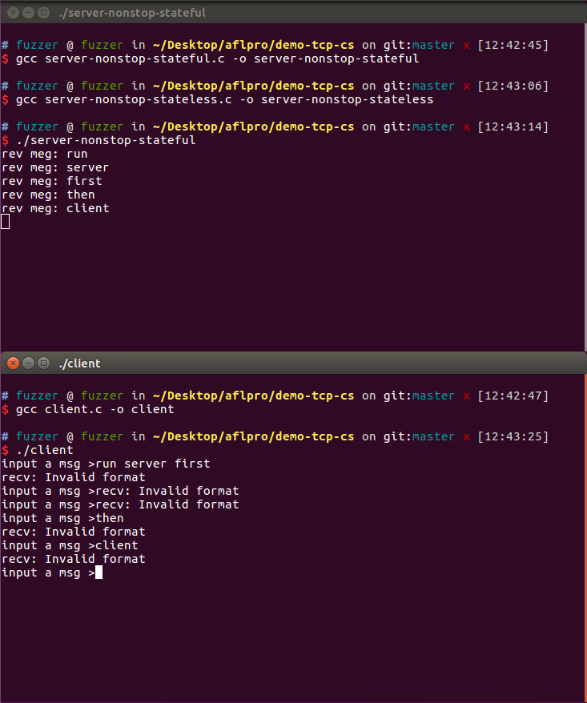
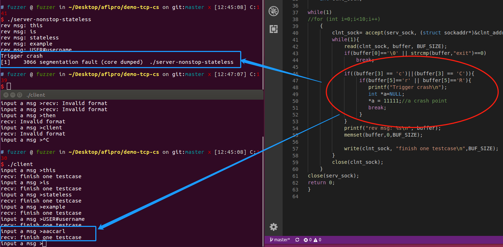
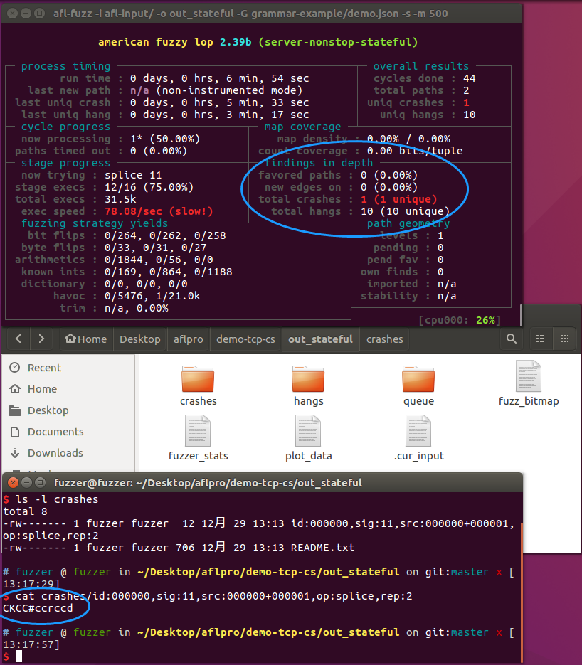
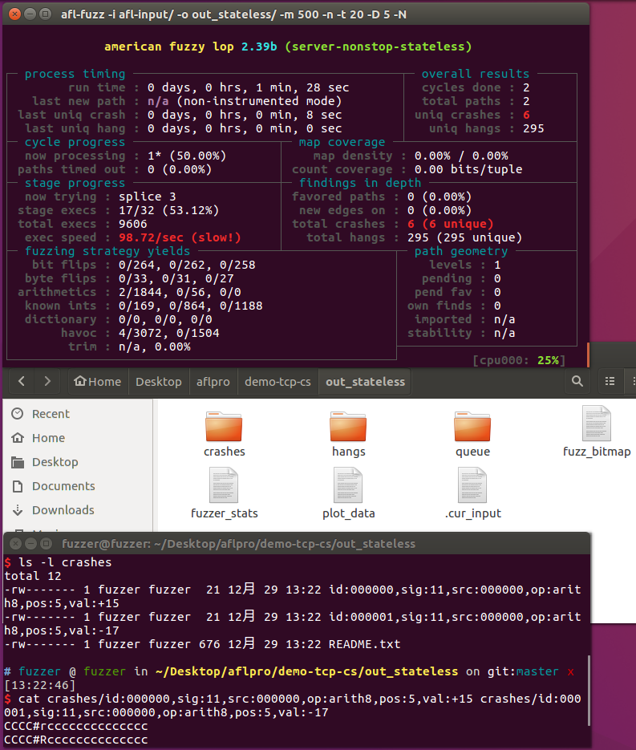

# 软件分析测试 - 作业2 - 实验报告
## 程序分析/测试工具的设计与实现

| 姓名 | 何杰煊    |
| ---- | --------- |
| 学号 | MF1833026 |

### 一、工具简介
工具名：暂定afl-pro
#### 模糊测试
1. 模糊测试（fuzzing）已经成为软件测试领域中流行的技术，其思路很简单，就是对目标程序提供非预期的输入并监视异常结果。之所以翻译为模糊测试是因为这些非预期的输入是“随机”生成测试。总的来说Fuzzing工具是一套自动化测试软件，其核心功能包括下面几点：<br>
    + 自动化测试框架，统一管理组织测试套件和测试用例的执行；
    + 测试用例生成器，也叫Fuzzer，用于生成随机的测试用例；
    + 监视器，用来监测被测设备是否正常，及时发现问题；
    + 报表及回溯模块，生成测试报告，并跟踪定位问题的上下文信息，方便问题回溯和进一步的分析。

#### AFL(American fuzzy lop)
1. AFL是2015年推出的Fuzzing工具，推出之后立刻在学术界和工业界流行起来。
2. AFL通过对源码进行重新编译时进行插桩的方式以及遗传算法自动产生测试用例来探索二进制程序内部新的执行路径，这样能通过覆盖信息指导测试用例的生成。
3. AFL的输入是通过文件传递的，因此原生的AFL无法对一个网络服务器或者是网络协议进行fuzz。

#### 功能与思路
1. 对AFL进行修改，使其能对网络服务器进行fuzzing。
2. 新增选项用于识别ip地址和端口号(-N)，而此时fuzzing的目标程序即为启动服务器的可执行文件。
3. 另外对服务器进行分类，分成有状态的和无状态的，有状态的意思是服务器的状态是有依赖的，例如先登录后使用，那么就是有状态的。理论上来说，AFL能对任何一个状态进行fuzzing，然而并不是每个状态都有fuzzing的意义（例如有些状态是缺陷敏感点，有些不是），因为定义有状态实际上是为了让服务器运行到我们希望的状态再进行fuzzing。
    + 对于有状态的服务器，该工具对状态构建状态图，而状态信息需要人为提供，在此用json格式给出（理论上用xml也是可以的）。
    + 当然服务器不是绝对的有无状态，这个概念只是对某个功能而言，实际上每个服务器应该是既有状态也无状态的。

#### 输入和输出
1. 总体来说，工具的输入输出和AFL是一致的
2. 根据AFL文档的说明，工具本身需要提供输入(`-i`)输出(`-o`)选项，以下对该实验用到的几个选项进行解析，这些选项包括自己修改后新增的选项：
3. `-i`：
    + 在AFL里更准确的说法是叫种子（seed），因为AFL是基于变异的Fuzzer，其生成的测试用例是根据种子进行变异的。
    + `-i`后接的是一个路径，种子就是放在这个路径下。另外种子可以很多个。
    + 种子本身也是个文件，因为AFL是通过文件传递的，而这种文件实际上从另一个角度定义了测试目标程序的输入规范。
    + 在此实验中`-i`就是一个文本文件，用于传递给服务器的消息的中介。
4. `-o`:
    + `-o`后也是接一个路径，是AFL生成的测试用例，但并不是全部测试用例（毕竟测试用例是随机的，量大，不可能全部存储），而是那些能引起目标程序（在此是服务器）crash的测试用例，以及一些AFL程序本身的状态信息（如路径覆盖信息等）。
    + fuzzing完成后，该路径下会有如下几个目录：  
        - `queue/`: 每个特定执行路径的测试用例，以及用户给出的所有其实文件（seed）
        - `crashes/`: 导致目标程序接收错误信号的特定测试用例（例如，SIGSEGV，SIGILL，SIGABRT）。条目按接收信号分组。
        - `hangs/`: 导致目标程序超时的特定测试用例。
    + 需要注意的是每个种类的测试用例即使有多个，也只会存储一个（第一个找到的），例如如果发现了100个crashes，但是其实只有5类，那么`crashes/`下也只会存储五个能引起crash的测试用例（每类一个，文件形式）
5. `-m`: 限制内存，以防目标程序接收到非预期输入导致内存爆炸让测试工具卡了。
6. `-t`: 限制超时，以防目标程序“死循环”让测试工具干等。
7. `-G`: ***自己修改新增的***，用于指明状态信息存储的位置
8. `-N`: ***自己修改新增的***，后接网络协议，IP地址，端口号，例如：`tcp://127.0.0.1:7891`

### 二、实现
1. 对AFL修改的地方主要在`afl-fuzz.c`，对工具新增三个option: `-G`,`-N`,`-D`。
2. `-G`是对提供的状态信息建图，核心代码如下：
    ```c
    if (G_option_specified)
    {
        // load protocol graph from a json file and create local representation
        prograph = create_protocol_graph(json_file);

        //testing code for prograph content
        ACTF("Numbers of Node: %d", prograph.NodeNum);
        int node_num = prograph.NodeNum;
        int i, j;

        for (i = 0; i < node_num; i++)
        {
            ACTF("The %d node id : %d, init: %d, inNum:%d, outNum:%d, fileNum %d",
                 i, prograph.vexs[i].id,
                 prograph.vexs[i].init,
                 prograph.vexs[i].inNum,
                 prograph.vexs[i].outNum,
                 prograph.vexs[i].FieldNum);
            int field_num = prograph.vexs[i].FieldNum;
            int outNum = prograph.vexs[i].outNum;
            for (j = 0; j < field_num; j++)
            {
                ACTF("The field type: %s, defaultValue: %s, constraint:%d, fuzzable:%d",
                     prograph.vexs[i].format[j].type,
                     prograph.vexs[i].format[j].defaultValue,
                     prograph.vexs[i].format[j].constraint,
                     prograph.vexs[i].format[j].fuzzable);
            }

            for (int k = 0; k < outNum; k++)
            {
                ACTF("The outNode: %d\n", prograph.vexs[i].outNode[k]);
            }
        }
    }
    ```
    其中json文件的形式如下：
    ```json
    {
        "ftp": [
            {
                "id": 0,
                "init": 1,
                "in": [],
                "out": [1],
                "format": [
                    {
                        "type": "static",
                        "defaultValue": "USER#username",
                        "constraint": 10,
                        "fuzzable": 0
                    },
                ]
            },
            {
                "id": 1,
                "init": 0,
                "in": [0],
                "out": [2],
                "format": [
                    {
                        "type": "static",
                        "defaultValue": "PASS#password",
                        "constraint": 4,
                        "fuzzable": 0
                    },
                ]
            },
            {
                "id": 2,
                "init": 0,
                "in": [1],
                "out": [],
                "format": [
                    {
                        "type": "static",
                        "defaultValue": "CCCC#cccccccccc",
                        "constraint": 4,
                        "fuzzable": 0
                    },
                ]
            }
        ]
    }
    ```

### 三、运行
#### 环境
1. AFL本身只支持*nix系统，因此实验环境选择ubuntu 16.04 64-bit，其中需要的依赖包有：`libjson-c-dev` `libjson0-dev` `libgtop2-dev`
2. 需要对网络进行延时设置：
    ```bash
    sudo vim /etc/sysctl.conf
    add following:
        net.ipv4.tcp_timestamps = 1
        net.ipv4.tcp_tw_reuse = 1
    sudo /sbin/sysctl -p
    sudo reboot
    ```
3. 和其他开源工具一样`make`和`sudo make install`编译生成可执行文件即可。

#### 示例在`./demo-tcp-cs`
1. 示例主要有两个服务器例子（有状态`server-nonstop-stateful.c`/无状态`server-nonstop-stateless.c`）和一个客户端`client.c`例子。其中我们在代码中设定了一个crash点强制crash以说明工具修改后的正确性（即能fuzzing服务器。以下是强制crash测试用例的代码。
    + crash code in `server-nonstop-stateful.c`，结合上述状态json例子，`if(hasLogin == 0)`代码块是用于跳过这些状态的。
    ```c
    if(hasLogin == 0){
        if(strcmp(buffer,"USER#username")==0){
            printf("rev meg: %s\n", buffer);
            memset(buffer,0,BUF_SIZE);
            write(clnt_sock, "Valid username, please input the password\n",BUF_SIZE);
            read(clnt_sock,buffer,BUF_SIZE);
            if(strcmp(buffer,"PASS#password")==0){
                    printf("rev meg: %s\n", buffer);
                    memset(buffer,0,BUF_SIZE);
                    write(clnt_sock, "Valid password, login successfully\n",BUF_SIZE);
                    hasLogin=1;
                    continue;
            }else{
                    printf("rev meg: %s\n", buffer);
                    memset(buffer,0,BUF_SIZE);
                    write(clnt_sock, "Invalid password, login failed\n",BUF_SIZE);
                    continue;
            }
        }else{

                printf("rev meg: %s\n", buffer);
                memset(buffer,0,BUF_SIZE);
                write(clnt_sock, "Invalid username, please try again\n",BUF_SIZE);
                continue;
        }
    }

    if(buffer[6] == 'c' || buffer[6]=='C'){
        if(buffer[7]== 'r' || buffer[7]=='R'){
            printf("Trigger crash\n");
            int *a=NULL;
            *a = 11111;//a crash pointi
            break;
        }
    }
    ```
    + crash code in `server-nonstop-stateless.c`，在下面的运行截图中将以这份代码作为crash测试点。
    ```c
    if((buffer[3] == 'c')||(buffer[3] == 'C')){
        if(buffer[5]=='r' || buffer[5]=='R'){
            printf("Trigger crash\n");
            int *a=NULL;
            *a = 11111;//a crash point
            break;
        }
    }
    ```
2. 编译命令为`gcc /path/to/input_c_file -o /path/to/output_file`
3. 客户端与有状态服务器交互示例：（需要先运行服务器，在运行客户端）
    
4. 客户端与无状态服务器交互示例：最后的输入是根据代码故意制造的一个crash输入，可以看出引起了段错误（`segmentation fault`）
    

#### fuzzing!
1. 有状态的服务器
    + 命令：`afl-fuzz -i afl-input/ -o out_stateful/ -G grammar-example/demo.json -s -m 500 -t 20 -n -D 10 -N tcp://127.0.0.1:7891 ./server-nonstop-stateful`
    + 运行截图与crash示例：注意到生成的crash生成用例是符合我们在代码中设置的crash code的。说明该工具至少能正确fuzzing服务器，而且也符合afl本身的功能。
    
2. 无状态的服务器
    + 命令：`afl-fuzz -i afl-input/ -o out_stateless/ -m 500 -n -t 20 -D 5 -N tcp://127.0.0.1:7891 ./server-nonstop-stateless` 
    + 运行截图与crash示例：
    

### 四、未来
1. 这个工具的思路来自于[学长](https://github.com/stuartly)，也是学长最先创建的[git repo](https://github.com/stuartly/aflpro)
2. 尝试更多的协议如ftp等，甚至使用真的服务器如Apache等而不是简单的localhost。